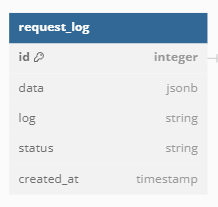
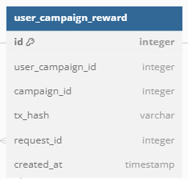
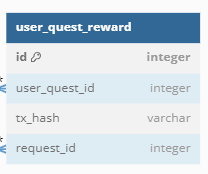
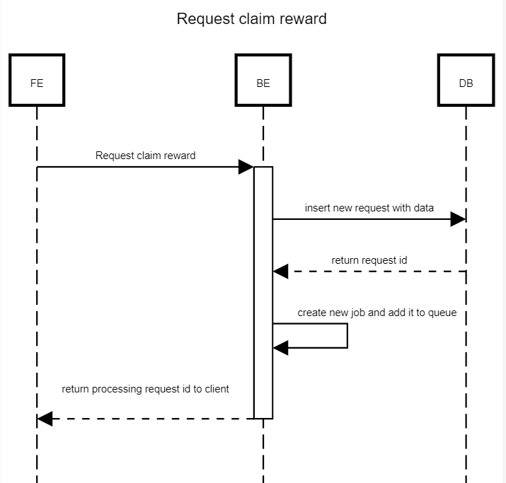
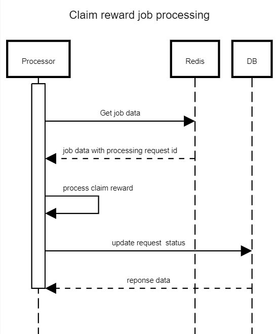
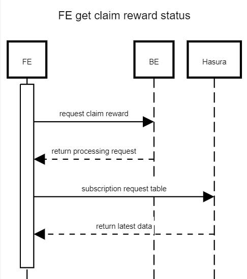

# Claim quest reward using queue

1. Overview

- Vấn đề hiện có: Khi cùng lúc claim reward nhiều lần => quá số lượng slot reward/quest
- Cách xử lý: Dùng queue
- Một số vấn đề gặp phải: Báo log cho user như thế nào khi xảy ra lỗi ở job. Khắc phục: tạo bảng request trong db, mỗi khi có request claim sẽ lưu 1 request processing vào db. Job thực hiện xong sẽ update vào db. Client dùng subscription vào hasura để lấy request status

2. Chi tiết

- Thêm bảng mới: `RequestLog`

  

- Thêm cột `request_id` cho các bảng reward

  

  

3. Sequence diagram

- Request claim reward

  

- Job processing

  

- FE get claim status

  
