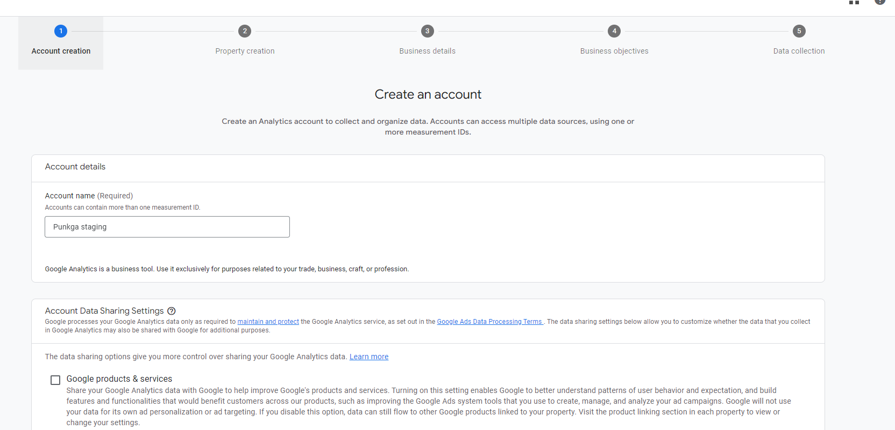
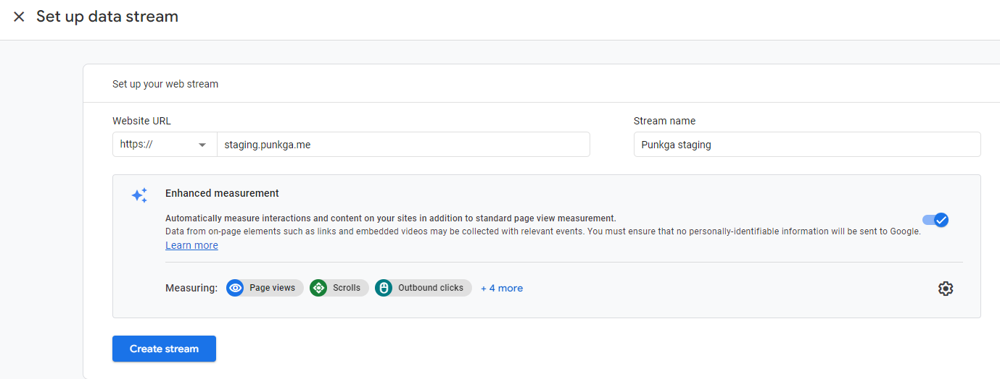
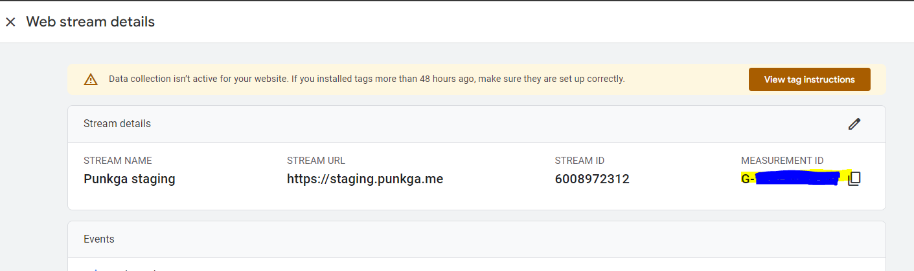
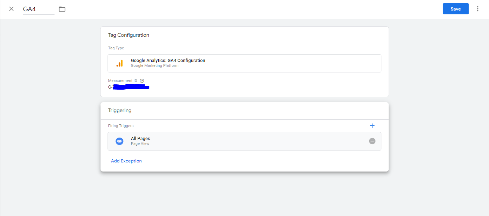
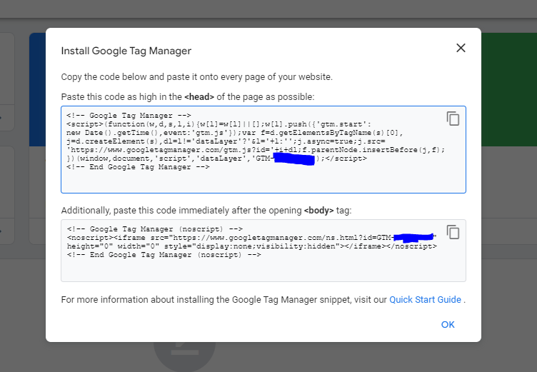

# How to setup google analytics

## Create google analytics

- Go to `https://analytics.google.com/analytics/web/`, create new account

- In `Account creation` section, fill `Account name` and press `Next`

  

- In `Property creation`, fill `Property name`, choose reporting time zone to `Vietnam GMT + 7`

- Next, fill bussiness details and objectives

- Accept terms
- Choose `Web` platform and set up data stream to web

  

- Copy `Measurement ID` in web stream detail

  

## Create google tag manager

- Go to `https://tagmanager.google.com/`, create new account

  

- Create new `Tag` with `Measurement ID` of `google analytics`

  

- Submit change

- Install `Google Tag Manager` in website

  
