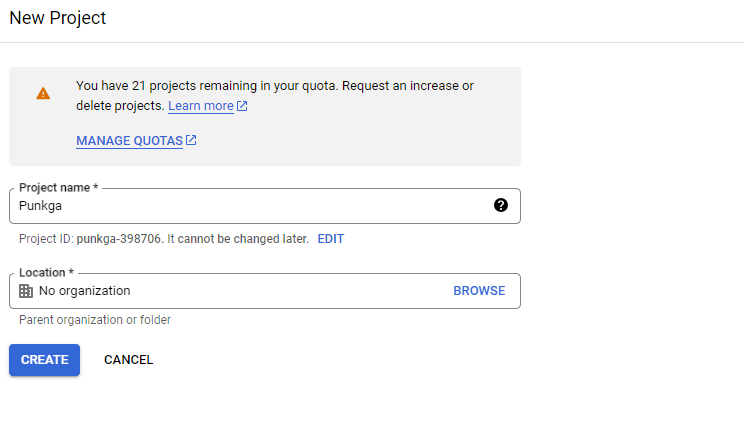
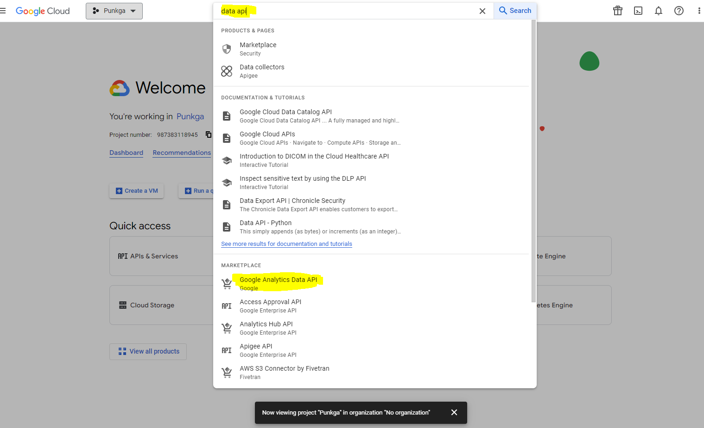
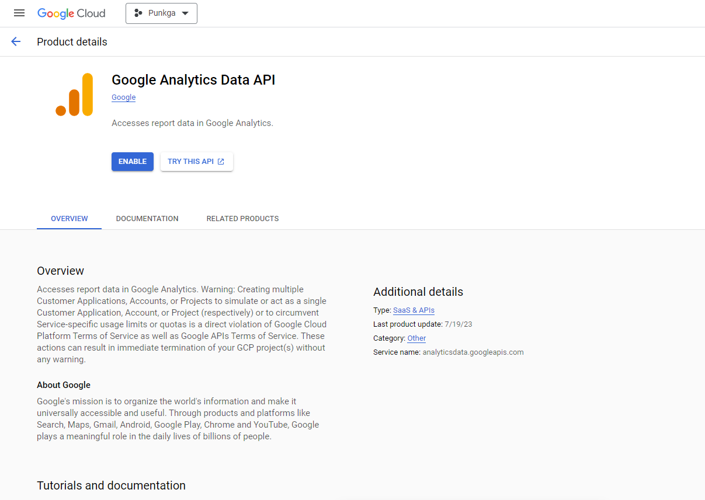
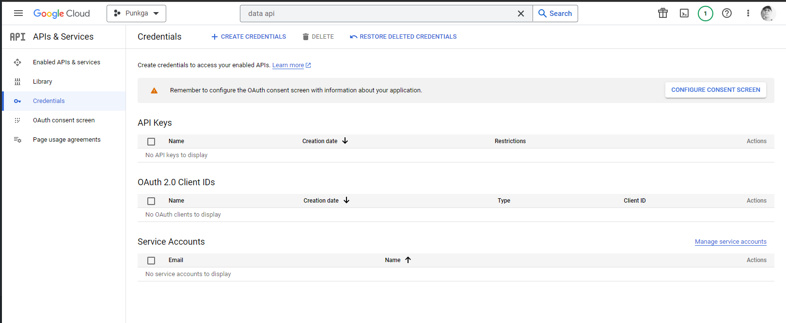
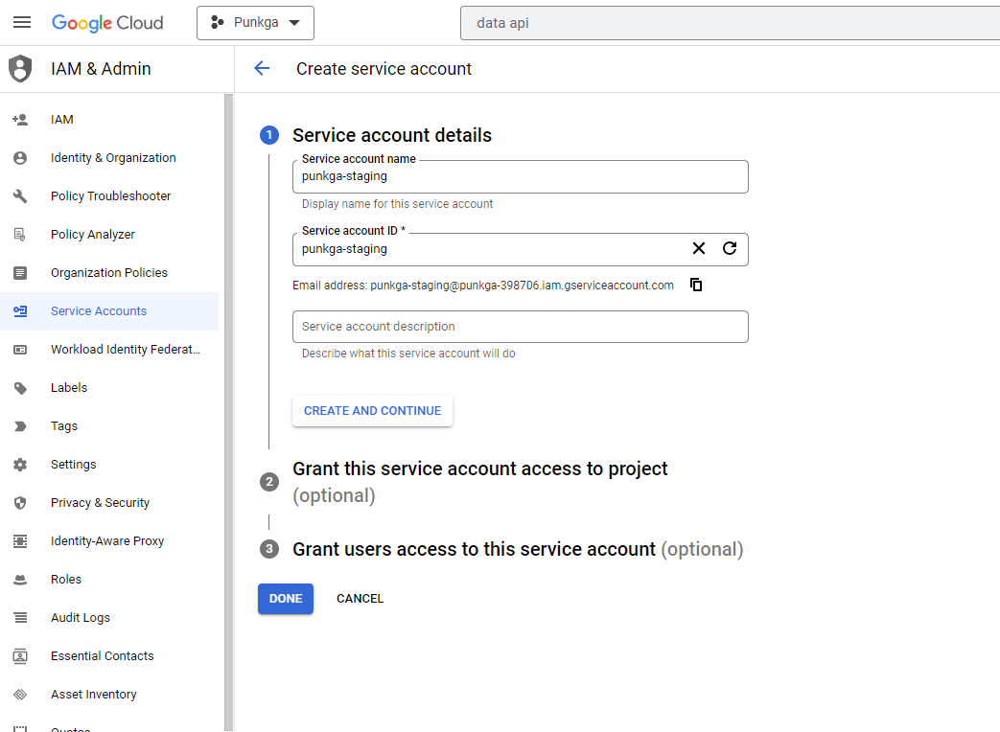
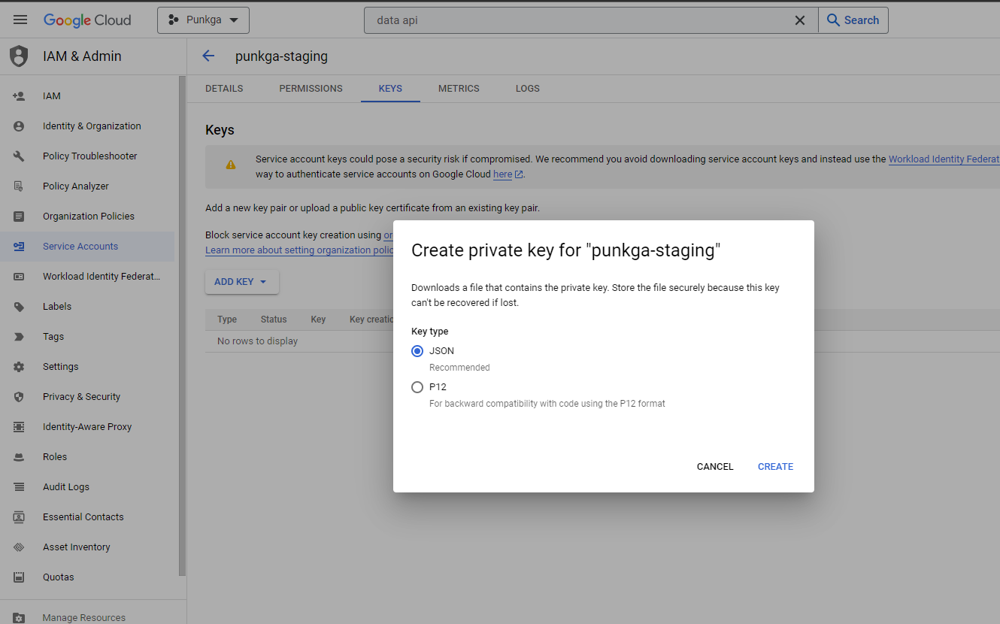

# How to setup google analytics

## Create google analytics

- Go to `https://analytics.google.com/analytics/web/`, create new account

- In `Account creation` section, fill `Account name` and press `Next`

  

- In `Property creation`, fill `Property name`, choose reporting time zone to `Vietnam GMT + 7`

- Next, fill bussiness details and objectives

- Accept terms
- Choose `Web` platform and set up data stream to web

  

- Copy `Measurement ID` in web stream detail

  

## Create google tag manager

- Go to `https://tagmanager.google.com/`, create new account

  

- Create new `Tag` with `Measurement ID` of `google analytics`

  

- Submit change

- Install `Google Tag Manager` in website

  

## Use Google Analytics API

1. Go to `https://console.cloud.google.com/`, create new `Project` or select existing project

    

2. Enable `Google Analytics Data API`

- Search `Google Analytics Data API`, go to this product details

  

- Press `Enable`

  

- Click `Credentials` in left panel. Create new or download existing service account credential

  

3. Create service account (if not exist)

- Create new service account, no need to provide any permission

  

- Add service account key, save to computer

  

4. Use `https://www.npmjs.com/package/@google-analytics/data` package in NodeJS app
