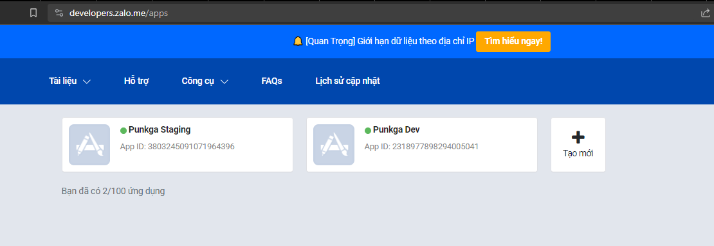
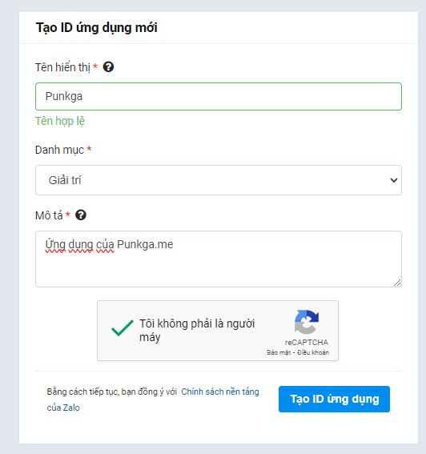
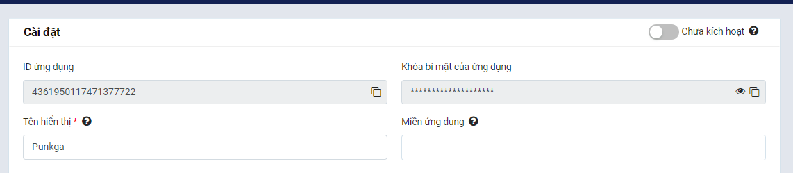

# How to setup zalo oauth

1. Create Zalo App

- Go to Zalo for Developers website: `https://developers.zalo.me/apps`
- Click on `Tạo mới` button

- Fill infomation and click `Tạo Id ứng dụng`

- Update phone number and email, enable "Chưa kích hoạt" option

2. Config Zalo App

- Setting Login
- Verify Domain

3. Change authorizer image

4. Add zalo config in gitops
